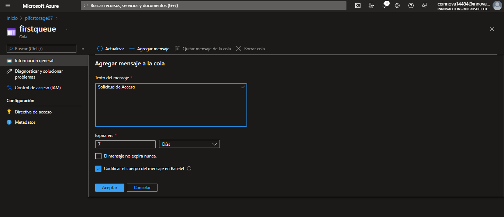

# Sexta sesión: Almacenamiento de datos en Azure

Esta sesión se dividio en tres partes:
- **Storage**: Servicio de almacenamiento de archivos
- **DataBase**: Servicios de bases de almacenamiento de datos de diferentes tipos y volumenes.
- **BigData**: Servicios para el procesamiento y análisis de una gran cantidad de datos.

Las dos practicas de hoy se basaron en las dos primeras divisiones de los servicios de Azure, y se abarcaron diferentes servicios en cada practica.

### Practica 1

Antes de iniciar con los servicios, es necesario crear una cuenta de almacenamiento, en la seccion de "Crear recursos" del portal de Azure.

##### Azure Blob Storage

Para usar este servicio, es necesario acceder a la seccion "Contenedores" del recurso creado anteriormente, cuidando que el acceso de lectura sea anonimo, para que de esta manera cualquier usuario pueda acceder.

Una vez creado, hay que cargar un archivo de nuestra elección para realizar la prueba.

De esta manera, podemos acceder al archivo desde un URL de internet desde cualquier dispositivo conectado a la red.

##### Azure File Storage

En la sección "Recurso compartido de archivos" de la cuenta de almacenamiento, hay que crear un recurso compartido de archivo.

A continuación, accedemos al recurso y cargamos un archivo. La utilidad de este servicio, es que mediante una clave de acceso de almacenamiento, podemos conectar nuestro archivos cargados a una computadora, usando el codigo que se proporciona en la interfas de PowerShell (en el caso de Windows).

##### Azure Table Storage

Accediendo al apartado de "Tablas" de la cuenta de almacenamiento, creamos una tabla.

Ahora bien, para poder hacer modificaciones a esta, tenemos que acceder al apartado "Explorador de almacenamiento, buscar el recurso y seleccionar "Agragar entidad".

En este apartado, podemos agregar los datos que deseemos a nuestra tabla. A diferencia de una base de datos, las tablas no siguen una estructura, por lo que son más eficientes y rápidas.

##### Azure Queue Storage

Accediendo al apartado "Colas" creamos una.

Podemos agregar todo tipo de mensajes de texto, teniendo la posibilidad de poder determinar la fecha de expiración de este.

### Practica 2

##### Consultas de SQL para Azure

Para esta practica, usaremos un [repositorio de GitHub](https://github.com/MicrosoftLearning/DP-900T00A-Azure-Data-Fundamentals), el cual nos creará la base de datos con los datos que usaremos.

Para empezar, hay que ejecutar los siguientes comandos en el Azure Cloud Shell:

> git clone https://github.com/MicrosoftLearning/DP-900T00A-Azure-Data-Fundamentals dp-900

>cd dp-900/sql

>bash setup.sh

Esto nos ha creado el recurso de la base de datos, por lo que es necesario acceder a este.
Una vez dentro, en el apartado "Editor de consultas" hay que poner el usuario y contraseña que se nos indica en la interfaz de Cloud Shell.

Una vez dentro de la base de datos, tenemos una terminal en la cual podemos colocar los comandos que deseamos ejecutar. Para realizar la prueba, ejecutaremos el comando:

> SELECT * FROM Inventory 
JOIN CustomerOrder ON Inventory.Id = CustomerOrder.InventoryId

Esta consulta es realizada a los datos que estaban dentro de la base de datos, y muestra los detalles de los pedidos realizados por los clientes junto con la información de inventario relativa a cada artículo solicitado.

##### Creacion de una base de datos con Cosmos DB

Primero debemos crear el recurso de Cosmos DB.

Una vez hecho esto, debemos acceder al recurso y elegir como lenguaje a Node.js, crear el contenedor _items_ e ingresar al explorador de datos. Todo esto es parte de la configuración inicial del recurso.

Luego, hay que ingresar al explorador de datos y generar un nuevo item y agregamos los datos con los comandos:

> {
    "Nombre del valor 1": "Valor 1",
    "Nombre del valor 2": "Valor 2",
    "Nombre del valor 3": "Valor 3"
}

Por cada grupo de datos diferente, es necesario crear un nunevo item. Para que muestre todos los datos de todos los items creados, podemos usar los mismos comandos que en SQL, por ejemplo:

> SELECT * FROM c.id

De esta manera concluimos con las practicas de esta sesión.

